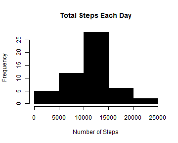
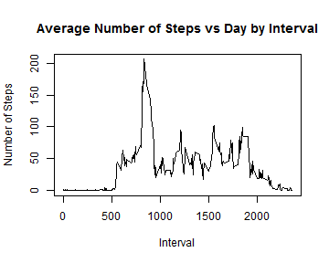
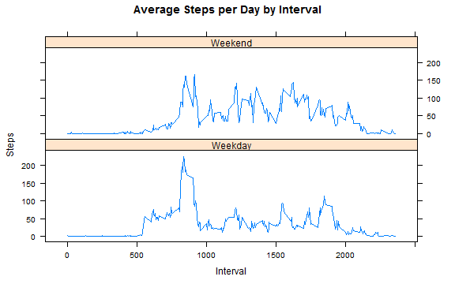

This analysis is part of the [Reproducible Research course](https://www.coursera.org/course/repdata).The data used in this analysis was gathered from from devices like [Fitbit](https://www.fitbit.com), [Nike Fuelband](http://www.nike.com/us/en_us/c/nikeplus-fuelband), or [Jawbone Up](https://jawbone.com/up). The work involves the following steps;  

1. Loading and pre-processing the data  
2. Finding mean total steps per day  
3. Finding average daily activity  
4. Imputing missing values  
5. Finding the difference between weekday and weekend activity pattern  


## Loading and preprocessing the data

The data for this analysis was downloaded from [here](https://d396qusza40orc.cloudfront.net/repdata%2Fdata%2Factivity.zip). The downloaded data must be cleaned to remove all the NA.


```r
if(!file.exists("getdata-projectfiles-UCI HAR Dataset.zip")) {  
        temp <- tempfile()  
        download.file("http://d396qusza40orc.cloudfront.net/repdata%2Fdata%2Factivity.zip",temp)  
        unzip(temp)  
        unlink(temp)  
}  

data <- read.csv("activity.csv")  
clean_data<-na.omit(data)  
```

## Mean number of step per day

The cleaned data is used to plot the histogram to understand the frequency of steps.


```r
steps_day <- aggregate(steps ~ date, clean_data, sum)
hist(steps_day$steps, main = paste("Total Steps Each Day"), col="black", xlab="Number of Steps")
```



```r
mean_steps <- mean(steps_day$steps)
median_steps <- median(steps_day$steps)
```

The computed `mean` is 1.0766189 &times; 10<sup>4</sup> and `median` is 10765.  

## Finding average daily activity


```r
steps_interval <- aggregate(steps ~ interval, clean_data, mean)

plot(steps_interval$interval,steps_interval$steps, type="l", xlab="Interval", 
     ylab="Number of Steps",main="Average Number of Steps vs Day by Interval")
```



```r
max_interval <- steps_interval[which.max(steps_interval$steps),1]
```

The maximum activity is observed in the 5 minute interval number 835.

## Imputing missing values

To avoid bias being introduced in the dataset, the missing data is imputed.


```r
imputed_data <- transform(data, steps = ifelse(is.na(data$steps), steps_interval$steps[match(data$interval, steps_interval$interval)], data$steps))

temp <- as.character.Date(unique(imputed_data$date))
imputed_data[as.character(imputed_data$date) == temp[1], 1] <- 0

imputed_steps_day <- aggregate(steps ~ date, imputed_data, sum)
hist(imputed_steps_day$steps, main = paste("Total Steps per Day"), col="black", xlab="Number of Steps")

#Create Histogram to show difference. 
hist(steps_day$steps, main = paste("Total Steps per Day"), col="red", xlab="Number of Steps", add=T)
legend("topleft", c("Imputed", "Non-imputed"), col=c("black", "red"), lwd=10)
```


```r
imputed_mean_steps <- mean(imputed_steps_day$steps)
imputed_median_steps <- median(imputed_steps_day$steps)
total_diff <- sum(imputed_steps_day$steps) - sum(steps_day$steps)
```

1. The number of missing observations in the dataset 2304.  
2. As shown in the above code chunk, the missing data for first day of the series is replaced by "0", while for the rest of the days it is the mean of that interval.
3. The difference in computed `mean` of actual data and cleaned data is -176.4948964.
4. The difference in computed `median` of actual data and cleaned data is 1.1886792. 
5. The difference in the total steps between the actual and the cleaned data is 7.5363321 &times; 10<sup>4</sup>.

## Finding the difference between weekday and weekend activity pattern

The difference in the activity pattern over the weekday and weekend can be observed from the below plots.


```r
weekdays <- c("Monday", "Tuesday", "Wednesday", "Thursday","Friday")

imputed_data$diff_week = as.factor(ifelse(is.element(weekdays(as.Date(imputed_data$date)),weekdays), "Weekday", "Weekend"))

imputed_steps_interval <- aggregate(steps ~ interval + diff_week, imputed_data, mean)

library(lattice)

xyplot(imputed_steps_interval$steps ~ imputed_steps_interval$interval|imputed_steps_interval$diff_week, main="Average Steps per Day by Interval",xlab="Interval", ylab="Steps",layout=c(1,2), type="l")
```



This exercise has helped me understand various aspects of the knitter package and how statistics can be applied on a dataset like this.
